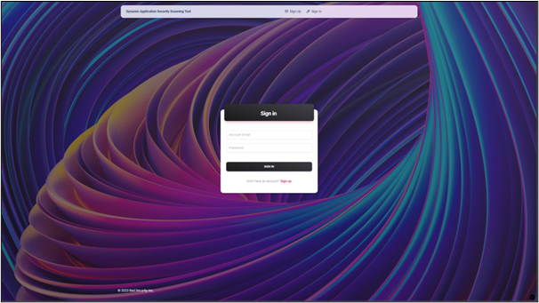
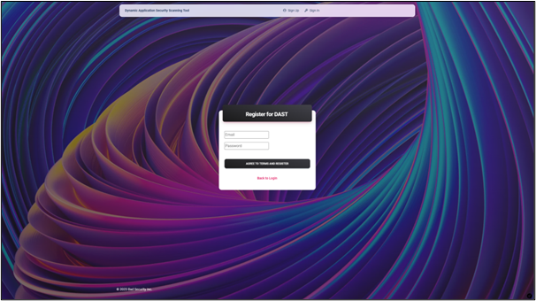
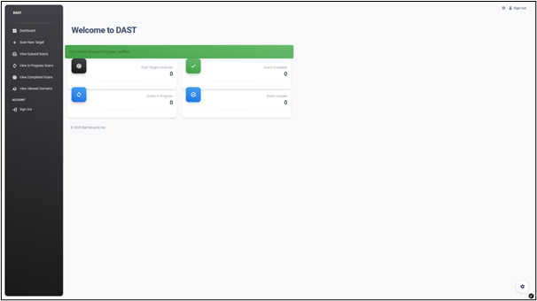
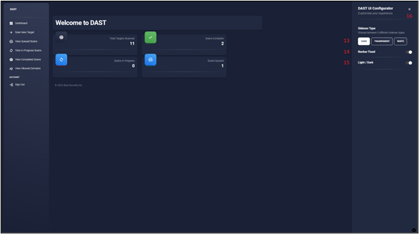
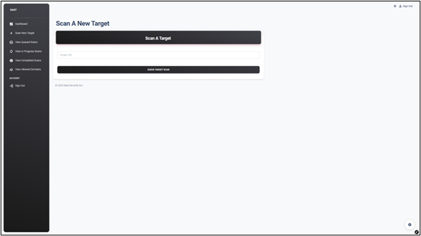
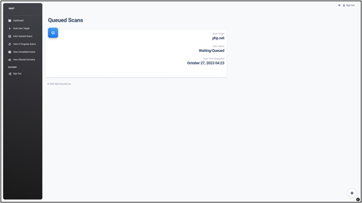
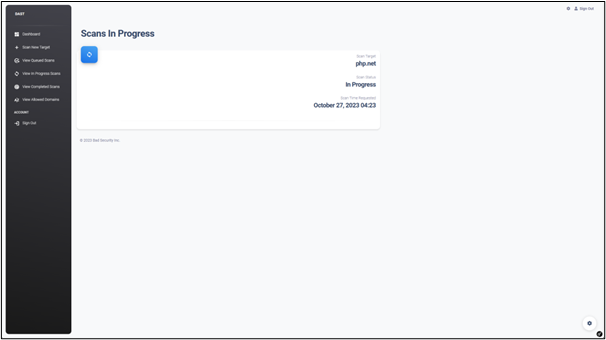
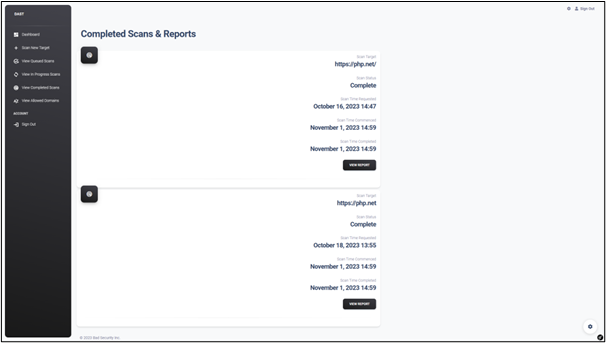
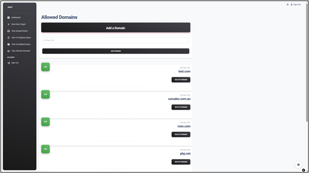

# DAST

## Description
Welcome to the dynamic application scanning tool (DAST). The DAST has been designed for cybersecurity proffesionals to quickly and
easily scan web pages to find any vulnerabilaties that may be affecting them. This automated scan will then generate a HTML report
that can be downloaded and viewed. The DAST has been written using PHP and the Symfony framework and intergates a number of common
vulnerability scanners and tools.

## Intallation
To install the DAST a .ovf file need to be downloaded and imported into VMWare. This ovf file includes all the neccassary tools
and dependancies needed for the DAST to function.

## Documentation
* [User Manual](https://docs.google.com/document/d/1slQt1afV-9569FhQ_NZDTvXNeN_BSuSnmost9d7YWV4)
* [System Deployment Manual](https://docs.google.com/document/d/1y8vWfB6ekHx_gMrEfUFuYZ0voTGKeAE6x9h8ddFGWms)

## Main Features
* Scanning for OWASP Top 10 vulnerabilities
* HTML severity report
* Domain whitelisting
* Web host recconaissance
* History of scans
* Secure login

## Gallery
### Landing Page

### Secure Registration

### Home Page

### Dark Mode Feature

### DAST Scans

### Allowed Domains

